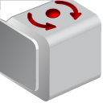

#  Gyro Sensor Interface

The Gyro Sensor Interface detects rotational motion. If you rotate the Gyro Sensor in the direction of the arrows on the case of the sensor, the sensor can detect the rate of rotation in degrees per second. You can use the rotation rate to detect, for example, when a part of your robot is turning, or when your robot is falling over.

# Data
The Gyro Sensor Interface provides the following data:

| Data   | Type    | Notes                                                                 |
|--------|---------|-----------------------------------------------------------------------|
| Angle  | Numeric | Rotation angle in degrees. Measured from the last reset. Reset with the Reset mode of the Gyro Sensor block. |
| Rate   | Numeric | Rotation rate in degrees per second.                                  |

