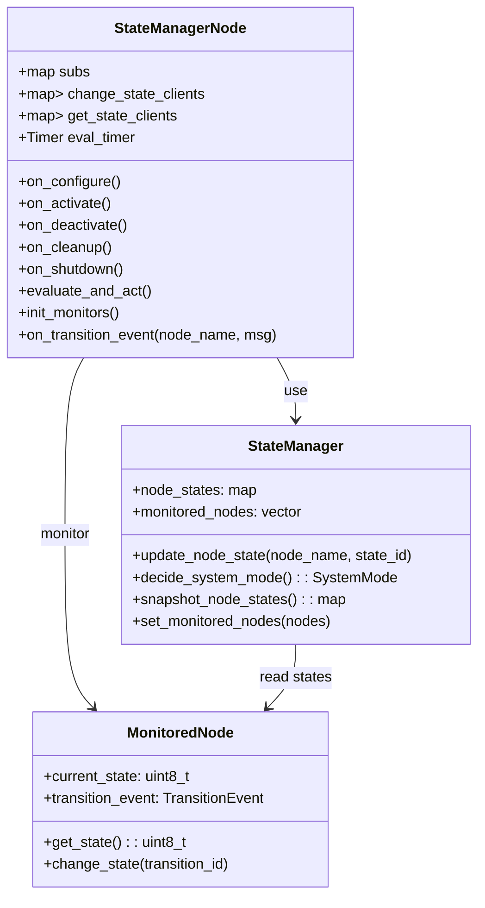
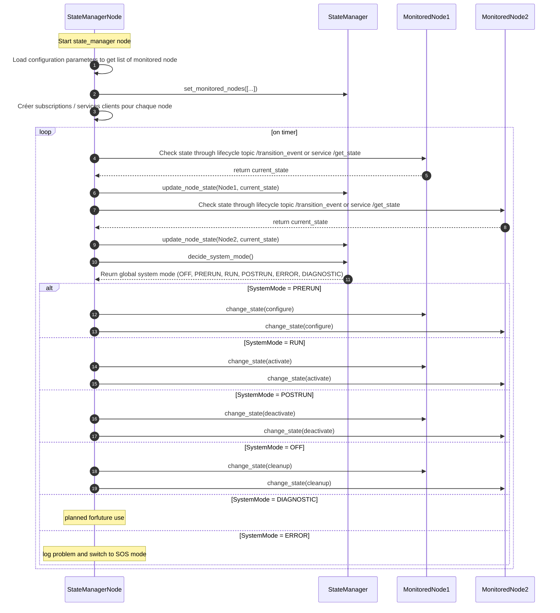

#  State Manager

## Bloc Definition Diagram

```mermaid
classDiagram
    class StateManagerNode {
        +map<string, Subscription> subs
        +map<string, Client<ChangeState>> change_state_clients
        +map<string, Client<GetState>> get_state_clients
        +Timer eval_timer
        +on_configure()
        +on_activate()
        +on_deactivate()
        +on_cleanup()
        +on_shutdown()
        +evaluate_and_act()
        +init_monitors()
        +on_transition_event(node_name, msg)
    }

    class StateManager {
        +node_states: map<string,uint8_t>
        +monitored_nodes: vector<string>
        +update_node_state(node_name, state_id)
        +decide_system_mode(): SystemMode
        +snapshot_node_states(): map<string,uint8_t>
        +set_monitored_nodes(nodes)
    }

    class MonitoredNode {
        +current_state: uint8_t
        +transition_event: TransitionEvent
        +get_state(): uint8_t
        +change_state(transition_id)
    }

    %% Relations
    StateManagerNode --> StateManager : use
    StateManagerNode --> MonitoredNode : monitor
    StateManager --> MonitoredNode : read states

```

## Sequence Diagram

```mermaid
sequenceDiagram
    autonumber
    participant SM as StateManagerNode
    participant SL as StateManager
    participant Node1 as MonitoredNode1
    participant Node2 as MonitoredNode2

    Note over SM: Start state_manager node
    SM->>SM: Load configuration parameters to get list of monitored node
    SM->>SL: set_monitored_nodes([...])
    SM->>SM: Créer subscriptions / services clients pour chaque node

    loop on timer
        SM->>Node1: Check state through lifecycle topic /transition_event or service /get_state
        Node1-->>SM: return  current_state
        SM->>SL: update_node_state(Node1, current_state)

        SM->>Node2: Check state through lifecycle topic /transition_event or  service /get_state
        Node2-->>SM: return current_state
        SM->>SL: update_node_state(Node2, current_state)

        SM->>SL: decide_system_mode()
        SL-->>SM: Reurn global system mode (OFF, PRERUN, RUN, POSTRUN, ERROR, DIAGNOSTIC)

        alt SystemMode = PRERUN
            SM->>Node1: change_state(configure)
            SM->>Node2: change_state(configure)
        else SystemMode = RUN
            SM->>Node1: change_state(activate)
            SM->>Node2: change_state(activate)
        else SystemMode = POSTRUN
            SM->>Node1: change_state(deactivate)
            SM->>Node2: change_state(deactivate)
        else SystemMode = OFF
            SM->>Node1: change_state(cleanup)
            SM->>Node2: change_state(cleanup)
        else SystemMode = DIAGNOSTIC
            Note over SM: planned forfuture use
        else SystemMode = ERROR
            Note over SM: log problem and switch to SOS mode
        end
    end
```